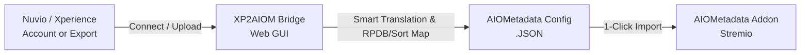

<div align="center">

# 🚀 XP2AIOM
### Nuvio / Xperience ➔ AIOMetadata Bridge

[](https://github.com/mckenna654/xp2aiom/releases)
[](https://ghcr.io/mckenna654/xp2aiom)
[](https://raw.githubusercontent.com/mckenna654/xp2aiom/main/unraid-template.xml)
[](https://www.python.org/)
[](https://opensource.org/licenses/MIT)

**A sleek, self-hosted WebGUI and conversion bridge that connects to your Nuvio / Xperience account, imports widget presets & catalogs, and generates ready-to-import AIOMetadata configurations for Stremio.**

[Features](#-features) • [Unraid Setup](#-unraid-installation) • [Docker Run](#-docker-deployment) • [How It Works](#-how-it-works) • [Screenshots](#-web-interface)

---

</div>

## 💡 What is XP2AIOM?

**Nuvio (formerly Xperience)** offers rich UI presets (like *Fusion*) and custom catalog groupings. **AIOMetadata** is the next-generation Stremio metadata addon for custom catalogs, multi-provider artwork (RPDB, TopPoster, Fanart), and unified search.

**XP2AIOM** bridges the gap: it allows you to log into your Nuvio account (or drop in your widget/manifest export JSON) and outputs a valid, formatted AIOMetadata configuration file ready for 1-click import into AIOMetadata's configuration dashboard.

> ### 💭 Why I Built This
> I created **XP2AIOM** because I really enjoy the **ease of use and layout design of Xperience/Nuvio**, while also strongly preferring the **power, privacy, and customization of self-hosting AIOMetadata**. This bridge gives you the best of both worlds—design your layout with Xperience, and host it effortlessly on your own AIOMetadata instance!



---

## ✨ Features

- **🌐 4 Ingestion Options**:
  - 🔑 **Nuvio Login**: Direct authentication with your Nuvio/Xperience account to pull your setup automatically.
  - 🔗 **Manifest URL**: Paste any live `manifest.json` URL.
  - 📁 **File Upload / Drag & Drop**: Drop your exported `fusion-widgets.json` or custom preset files.
  - 📝 **Raw JSON Paste**: Paste JSON layout payloads directly into the browser.
- **🧠 Smart Catalog & Filter Translation**:
  - Automatically translates MDBLists, Trakt Lists, TMDB, Studios (A24, Marvel, Disney), Decades, Genres, and Streaming Services (Netflix, Disney+, Apple TV+, HBO Max, Prime, Paramount+).
  - Preserves pagination and sorting rules (`sort`, `order`, `cacheTTL`, `type`).
  - Strips out pure frontend styling (badges, layout cards) that AIOMetadata does not require.
- **🧬 Base Config Template Merging**:
  - Upload your existing `aiometadata-config.json` to keep your API keys (TMDB, Trakt, RPDB, Gemini, MDBList), Art Providers, and custom descriptions while updating catalogs.
- **📊 Live Interactive Preview**:
  - Real-time catalog metrics and provider breakdown.
  - Searchable, filterable catalog table with individual toggle checkboxes.
- **⚡ 1-Click Export**:
  - Instant `.json` file download (`aiometadata-config-YYYY-MM-DD.json`).
  - Direct "Copy to Clipboard" button.
- **🐳 Self-Hosted & Containerized**:
  - Ready for Unraid, Docker Compose, Portainer, TrueNAS, and Synology.

---

## 🎛️ Unraid Installation

### Method 1: Using the Unraid Template (Recommended)

1. Open your **Unraid WebGUI** and navigate to the **Docker** tab.
2. Under **Template Repositories**, add:
   ```
   https://raw.githubusercontent.com/mckenna654/xp2aiom/main/unraid-template.xml
   ```
3. Or click **Add Container** and enter:
   - **Name**: `xp2aiom`
   - **Repository**: `ghcr.io/mckenna654/xp2aiom:latest`
   - **Port**: `8080` (Container) ➔ `8080` (Host)
   - **WebUI**: `http://[IP]:[PORT:8080]/`
4. Click **Apply**. Open the Web UI by clicking the container icon and selecting **WebUI**.

---

## 🐳 Docker Deployment

### Docker Compose (Recommended)

```yaml
version: "3.8"

services:
  xp2aiom:
    image: ghcr.io/mckenna654/xp2aiom:latest
    container_name: xp2aiom
    restart: unless-stopped
    ports:
      - "8080:8080"
    environment:
      - PORT=8080
      - HOST=0.0.0.0
```

Run:
```bash
docker compose up -d
```

### Docker Run CLI

```bash
docker run -d \
  --name xp2aiom \
  -p 8080:8080 \
  --restart unless-stopped \
  ghcr.io/mckenna654/xp2aiom:latest
```

---

## 💻 Local Development

```bash
# 1. Clone repository
git clone https://github.com/mckenna654/xp2aiom.git
cd xp2aiom

# 2. Install dependencies
pip install -r requirements.txt

# 3. Start the server
uvicorn app.main:app --host 0.0.0.0 --port 8080 --reload
```
Navigate to `http://localhost:8080`.

---

## 📖 How to Use

1. Open **XP2AIOM** (`http://<your-server-ip>:8080`).
2. Choose your preferred input method:
   - Click **Nuvio Login** and enter your credentials, OR
   - Drag & drop your `fusion-widgets.json` file into the upload zone.
3. *(Optional)* Upload your current `aiometadata-config.json` under **Merge with Existing AIOMetadata Config** if you want to keep your API keys.
4. Select your preferred catalog naming style (`[Category] Name`, `Clean`, or `Preserve`).
5. Click **Generate AIOMetadata Configuration**.
6. Review your catalogs in the interactive preview table.
7. Click **Download .JSON** or **Copy JSON**.
8. Go to your **AIOMetadata Configuration Dashboard**, click **Import Config**, and paste or upload your file!

---

## 🗺️ Schema Mapping Table

| Xperience / Nuvio | AIOMetadata Target | Description |
| :--- | :--- | :--- |
| `collection.row` items | Individual Catalogs | Formatted with category tags (e.g. `[Streaming Services] Netflix`) |
| `row.classic` | Standalone Catalogs | Row widgets translated directly to catalog lists |
| `catalogId: "movie::mdblist.158678"` | `id: "mdblist.158678"` | Clean ID and source identification (`mdblist`, `trakt`, `tmdb`, etc.) |
| `streaming_netflix_movies` | `streaming.nfx` | Dynamic streaming catalog provider mapping |
| `studio_a24_movies` | `tmdb.studio.a24` | Studio discovery catalogs |
| `genre_action_movies` | `tmdb.genre.action` | Genre discovery catalogs |
| `cacheTTL`, `sort`, `order` | Preserved | Preserves API caching and sorting parameters |
| `badges`, `presentation`, `images` | Stripped | Pure UI parameters stripped out |

---

## 📄 License
This project is licensed under the [MIT License](LICENSE).
