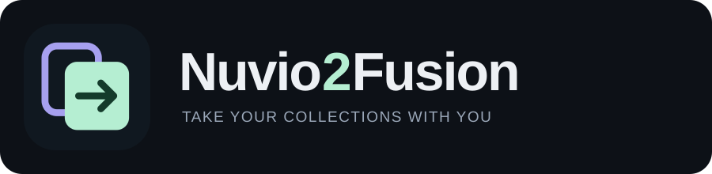

<p align="center">
  
</p>

<p align="center">
  <strong>Your Nuvio collections. Your Fusion home screen.</strong><br>
  A small, self-hosted tool for converting Nuvio collections into Fusion widget JSON.
</p>

<p align="center">
  <a href="https://github.com/mckenna654/nuvio2fusion/actions/workflows/docker-publish.yml"></a>
  <a href="LICENSE"></a>
  
</p>

## What it does

Export your configured collections from Nuvio, open the JSON in Nuvio2Fusion, resolve any missing addon URLs, and download a Fusion widget file. Existing Fusion widget exports can also be checked and re-exported.

Nuvio2Fusion preserves the layout and references to your original catalog sources. It does **not** host catalogs, replace your providers, copy account data or install anything in Fusion automatically. Keep the referenced addons installed and accessible in Fusion.

- Preserve collection and folder order, titles, covers, tile shapes and hidden folder titles.
- Keep multiple catalog sources in each folder, including their genre selections.
- Resolve addon IDs to their full manifest URLs without guessing another provider.
- Preserve supported classic rows and native sources when the input is already a Fusion export.
- Review every omitted source, missing URL and unmapped visual setting before importing.
- Download the widget JSON and a separate compatibility report.
- Run locally with Python or Docker; conversion makes no outbound catalog or artwork requests.

**This is a collections converter, not a full Nuvio backup converter.** Player settings, credentials, watch history, libraries and home rows absent from the export are not transferred.

## Quick start

**Installing on Unraid?** Use the [Unraid installation guide](docs/UNRAID.md) and the [v2.0.3 release downloads](https://github.com/mckenna654/nuvio2fusion/releases/tag/v2.0.3). The public image is `ghcr.io/mckenna654/nuvio2fusion:2.0.3`; no registry login is needed.

### Run with Python

Requires Python 3.11 or later. Node.js is only needed for development checks, not to run the app.

```sh
git clone https://github.com/mckenna654/nuvio2fusion.git
cd nuvio2fusion
python3 -m venv .venv
.venv/bin/python -m pip install -r requirements.txt
.venv/bin/python run.py
```

Open **[http://localhost:7088](http://localhost:7088)**. On Windows, use `.venv\Scripts\python.exe` instead of `.venv/bin/python`.

The application binds to `127.0.0.1` by default. It does not require an account or API key.

### Build locally with Docker Compose

From the repository directory:

```sh
docker compose up --build -d
```

Then open [http://localhost:7088](http://localhost:7088). The supplied Compose file builds your checkout and binds the published port to localhost.

```sh
docker compose logs --tail=100
docker compose down
```

To update a local build, pull the repository changes and run `docker compose up --build -d` again. No persistent volume is required.

### Use the published container

Published images are available from [GitHub Container Registry](https://github.com/mckenna654/nuvio2fusion/pkgs/container/nuvio2fusion). For the pinned release:

```sh
docker run -d \
  --name nuvio2fusion \
  --restart unless-stopped \
  -p 127.0.0.1:7088:7088 \
  ghcr.io/mckenna654/nuvio2fusion:2.0.3
```

`latest` follows successful builds of `main`; `sha-<commit>` identifies a particular build. Version tags are generated when a matching `v<version>` Git tag is published. Builds target Linux `amd64` and `arm64`. Check [Actions](https://github.com/mckenna654/nuvio2fusion/actions) before assuming a particular image tag exists.

For Unraid, the [installation guide](docs/UNRAID.md) covers the [versioned XML template](unraid-template.xml), manual Add Container setup and updates. No appdata or media volumes are needed. [docker-compose.release.yml](docker-compose.release.yml) runs the prebuilt release without cloning or building the application. Both Compose examples bind to localhost by default; set the release file's `NUVIO2FUSION_BIND_IP` to your server's LAN address for trusted network access. The app has no authentication layer.

## Convert a setup

1. **Back up your existing Fusion widgets.** Keep the original Nuvio export as well.
2. **Export collections from Nuvio.** Use its collection-management export. The usual result is a JSON array of collections, not a manifest URL or account backup.
3. **Upload or paste the JSON** into Nuvio2Fusion. The **Addon to connect** menu lists addon IDs found in your file, with their catalog counts.
4. **Connect only the addons you use.** Choose an addon, paste its normal URL in **Addon manifest URL**, and click **Connect addon**, then select **Convert to Fusion**. For `aio-metadata`, use your own configuration's full install URL, not its homepage. Leave optional addons such as Bingecat blank: their sources are omitted with a warning, while connected sources remain exportable. You can also convert first and fill the optional missing-URL fields. No JSON formatting is needed.
5. **Review the results.** Inspect omitted sources, empty folders and settings that need attention. Use the search and result filter to find affected rows.
6. **Download Fusion widgets.** The compatibility report is a separate download for your review; it is not a Fusion import file.
7. **Import through Fusion's widget import.** Use the downloaded file or its JSON text as supported by your Fusion version. Keep the required addons installed and test a few folders after import.

If your Fusion device only offers URL import, use a Fusion client that accepts the file/text or a private hosting method you control. Widget files can contain account-specific install URLs: **do not publish them to a public gist or repository**.

The two bundled examples use deliberately nonfunctional addon/artwork URLs. They demonstrate structure and reporting, not working catalog feeds.

## Addon URL mapping

Nuvio often stores a logical addon ID, such as `my.addon`. Fusion stores the full manifest URL. Nuvio2Fusion resolves each source in this order:

1. An explicit URL mapping for that addon ID.
2. The source's `manifestUrl`.
3. The source's `addonBaseUrl`, with `/manifest.json` appended when needed.
4. An HTTP(S) or `stremio://` URL already stored in `addonId`.

Normally, choose **Addon to connect**, paste the full URL in **Addon manifest URL**, and click **Connect addon**. The saved URL remains editable in a labelled field. A URL entered before clicking **Convert to Fusion** is also saved when an addon is selected. One URL is never guessed to apply to every addon.

For bulk entry only, enter an object under **Advanced: JSON URL mappings**:

```json
{
  "my.movie.addon": "https://movies.example/config/manifest.json",
  "my.series.addon": "https://series.example/profile/manifest.json"
}
```

Use the **exact original addon ID** as the key. Do not bind an unrelated provider simply because it has a similar name: the original catalog IDs must exist at that URL. One mapping is never silently applied to every addon.

Mappings may override an obsolete embedded URL. Configuration path segments and query parameters are preserved. `stremio://` install URLs are normalized to HTTPS. URLs are validated but never fetched during conversion.

## Compatibility

| Input feature | Output behavior |
| --- | --- |
| Collections and folders | Collection widgets and folder items, in original order |
| Titles and hidden folder titles | Preserved |
| Cover image URLs | Preserved as remote HTTP(S) artwork references |
| Poster / landscape / square tiles | Mapped to Fusion poster / wide / square |
| Multiple addon sources per folder | Preserved in order |
| Catalog IDs and genre selections | Preserved with Fusion's `type::catalogId` representation |
| Both `sources` and `catalogSources` | `sources` is authoritative; the legacy mirror is not duplicated |
| Missing addon URL | Its sources are omitted with a warning; connected addons remain exportable |
| Nuvio-native TMDB or Trakt query | Reported as unsupported; no speculative Fusion payload is invented |
| Focus GIF, emoji, hero backdrop/video, title logo | Reported as unmapped; no equivalent is claimed |
| Nuvio collection view, background or pinning settings | Listed for review when present |
| Existing Fusion classic rows | Supported presentation, numbering, limit and cache TTL retained |
| Existing Fusion-native source | Payload retained; account/library contents are not copied |
| Unknown widget type | Omitted and reported |

Classic addon rows require `movie` or `series`. Other catalog types can be retained inside collection folders; incompatible classic rows are reported. Empty folders remain visible in the preview. A file with no usable sources cannot be downloaded. Missing or duplicate layout IDs receive deterministic replacements and an issue entry.

See [the format contract and implementation notes](docs/FUSION.md) for field mappings and evidence.

### Understanding the report

- **Sources kept:** source references represented in the output. Several folders may refer to the same catalog.
- **Sources omitted:** references that need a URL, a compatible source, or another repair.
- **Layout issues:** settings without a verified mapping, repaired IDs/titles, or empty folders.
- **Complete:** no detected omission, repair, empty folder or unmapped setting. It is not a guarantee of live catalog access or pixel-identical rendering.

A partial conversion downloads as `fusion-widgets-partial.json`. A complete conversion downloads as `fusion-widgets.json`. The separate `fusion-compatibility-report.json` explains the result. Missing addon URLs, omitted sources and empty folders produce warnings without an acknowledgement checkbox. You can download as long as usable sources and supported widgets remain. Folders relying only on skipped addons retain their tiles but have no catalogs.

**Recovering an empty file from version 2.0.0:** start again with the original Nuvio export. That version allowed downloads containing folders but no catalog links. Installing AIOMetadata in Fusion afterward cannot reconnect them, and re-importing the empty Fusion file cannot recover the missing IDs. Supply the original addon URLs during conversion, confirm the source counts, then import the corrected widgets. Back up your Fusion layout before replacing the empty copies.

The import file has this envelope:

```json
{
  "exportType": "fusionWidgets",
  "exportVersion": 1,
  "requiredAddons": [],
  "widgets": []
}
```

Only the widget file goes into Fusion. Do not import the report or the entire API response.

## Configuration and privacy

| Setting | Default | Purpose |
| --- | --- | --- |
| `HOST` | `127.0.0.1` with Python; `0.0.0.0` inside Docker | Listening address |
| `PORT` | `7088` | Listening port |
| Browser upload limit | 5 MiB | Maximum individual source file |
| API request limit | 10 MiB | Maximum request body |
| Conversion limits | 1,000 widgets/collections; 10,000 source references | Bound large inputs |

For example, `PORT=8080 .venv/bin/python run.py` changes the local port. If you change the container's internal `PORT`, update its published port mapping too.

- Uploaded data and results are held in server memory; the application does not persist them. Browser downloads are saved by your browser.
- The converter does not contact catalog providers, fetch artwork, authenticate accounts or probe private APIs.
- The UI loads its own local scripts, styles and logo. It does not use analytics, remote fonts or external preview images.
- Downloads can contain private addon URLs and tokens. Keep them private and inspect exports before sharing.
- Reports omit addon URL fields but retain titles, catalog IDs and setting names; those may still be personal.
- Requests have body limits and same-origin checks. Responses use a restrictive content-security policy, no-store caching and no-referrer policy. Validation errors avoid reflecting submitted values.
- **There is no built-in authentication.** Keep the app local. For shared access, provide your own authenticated HTTPS reverse proxy; do not expose the port directly to the internet.

## API

The machine-readable API schema is available at `/openapi.json` on your local instance. The interactive CDN-based documentation pages are disabled so the app stays self-contained.

| Method | Endpoint | Purpose |
| --- | --- | --- |
| `GET` | `/api/health` | App name, version and health |
| `GET` | `/api/presets/nuvio` | Neutral Nuvio example in `rawData` |
| `GET` | `/api/presets/fusion` | Neutral Fusion example in `rawData` |
| `POST` | `/api/fusion/convert` | Convert JSON and return `fusionConfig` plus `report` |

Example request:

```json
{
  "export_data": [
    {
      "id": "weekend",
      "title": "Weekend",
      "folders": [
        {
          "id": "movies",
          "title": "Movies",
          "tileShape": "POSTER",
          "catalogSources": [
            {"addonId": "my.addon", "type": "movie", "catalogId": "popular"}
          ]
        }
      ]
    }
  ],
  "addon_urls": {
    "my.addon": "https://addon.example/config/manifest.json"
  }
}
```

Save that body as `request.json`, then:

```sh
curl --fail-with-body http://127.0.0.1:7088/api/fusion/convert \
  -H 'Content-Type: application/json' \
  --data-binary @request.json > response.json
```

`export_data` accepts a Nuvio collection array, a single collection, `{ "collections": [...] }`, a Fusion widget array, or a Fusion widget v1 envelope. Full-backup fields outside `collections` are not transferred and are reported. Manifests and unrecognized structures are rejected.

Responses contain `success`, `fusionConfig`, `previewWidgets` and `report`. `success` means the input was analyzed; check **`report.canExport`** before saving an import. Missing addons are warnings and do not block connected sources. If no usable sources or supported widgets remain, `fusionConfig` is `null`, `previewWidgets` contains the diagnostic layout, and `report.exportBlockReason` explains the repair. Once exportable, save **only `fusionConfig`**. `report.requiresPartialApproval` is retained for compatibility and is always `false`; omissions are listed in `report.missingAddons`, source records and warnings. Invalid structures/mappings return HTTP 400, invalid request fields 422, cross-origin posts 403, and oversized requests 413.

## Troubleshooting

| Problem | What to check |
| --- | --- |
| Missing manifest URL | Supply the URL only if you use that addon. Otherwise leave it blank and download the partial export. |
| Advanced mappings JSON error | Use **Addon manifest URL** for a normal URL. If a plain URL was pasted into the advanced field, converting moves it into the normal field; choose its addon and convert again. |
| Empty folders from a 2.0.0 download | Reconvert the original Nuvio JSON with URLs for the addons you want to keep. Manually installing an addon cannot restore omitted catalog references. |
| Download blocked | No usable sources or supported widgets remain. Connect at least one addon you use, or review the source report for unsupported queries. |
| Tiles appear, but catalogs fail | Confirm the referenced addon is installed, accessible and still serves those catalog IDs. Conversion does not test the service. |
| Artwork is missing | The original URL must remain reachable. Example URLs intentionally do not resolve. |
| File is marked partial with all sources kept | Review unmapped visual settings or repaired layout IDs. Source coverage and layout fidelity are separate. |
| Invalid JSON | Export collections again and avoid copying Markdown code fences into the input. |
| Fusion rejects the import | Confirm widget export v1 support, import the widget file rather than the report, and review unsupported row types. |
| Browser shows an earlier result | Editing input clears results; convert again after changing a URL or file. Refresh after updating the app. |

When reporting a problem, include app/Fusion/Nuvio versions, the report and a minimal **sanitized** example. Replace account URLs, tokens and private titles first.

## Development and verification

```sh
.venv/bin/python -m pip install -r requirements-dev.txt
.venv/bin/python -m unittest discover -s tests -v
node --check app/static/js/fusion.js
git diff --check
```

The suite covers URL resolution, source mirrors, ordering, multiple providers, native-source limitations, partial reports, duplicate IDs, Fusion round-trips and API privacy/boundaries. A sanitized fixture exercises **13 widgets, 65 folders and 308 source references**. The browser-generated download has also been compared with the expected widget JSON.

CI tests Python 3.11 and 3.14 before publishing Linux container images, then starts the published image on an `amd64` runner and verifies its non-root user, health endpoint, page and example conversion. Pull requests run checks without publishing. Schema checks do not replace testing an import in your Fusion version.

Project layout: `app/fusion.py` handles conversion; `app/main.py` serves the API; `app/static/js/fusion.js` handles the browser workflow; `app/presets/` contains neutral examples; `tests/` contains regression coverage.

## Project identity and license

**Nuvio2Fusion** — *take your collections with you.* The original vector mark represents two collection tiles and a forward transfer arrow. SVG and PNG assets are in [`app/static/brand/`](app/static/brand/); see [brand asset notes](docs/BRANDING.md).

[MIT licensed](LICENSE). Independent community software, not affiliated with or endorsed by Nuvio or Fusion. Their names belong to their respective owners. Read [release notes](RELEASE_NOTES.md) for changes and upgrade guidance.
